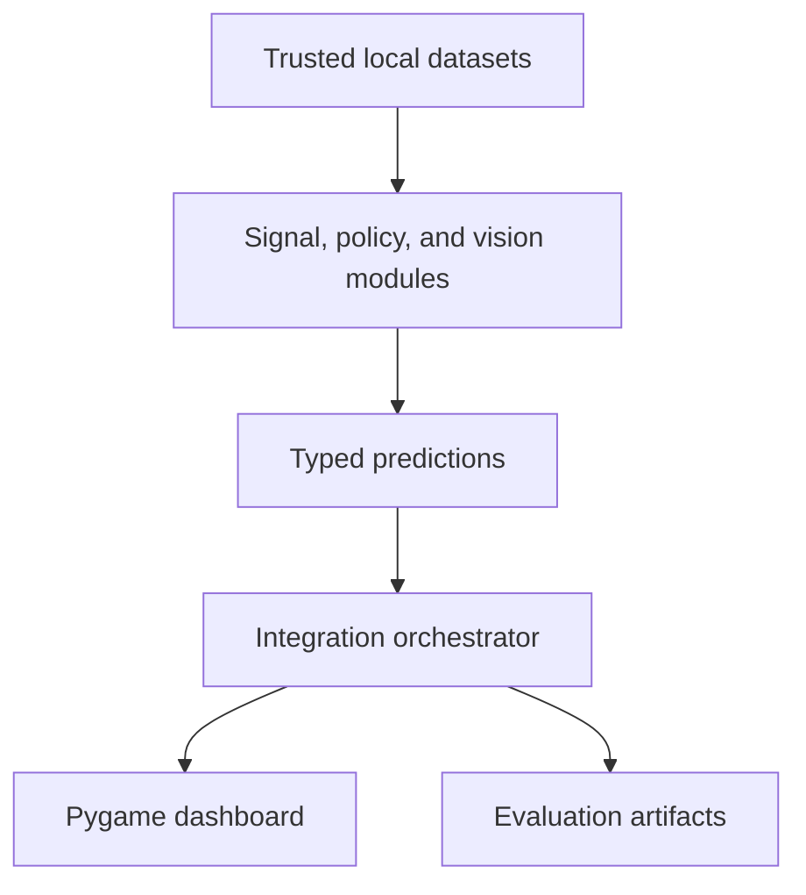

# Architecture

The system uses four boundaries: model modules, integration, presentation, and
artifact storage.

## Module contracts

### Signal module

- Input: fixed-length, two-channel I/Q samples
- Output: communication-modulation label, confidence, and SNR group
- Boundary: it does not claim to identify operational radar systems

### Policy module

- Input: normalized, fictional scenario variables
- Output: one abstract action ID and policy confidence
- Boundary: it contains no real platform parameters or operational tactics

### Vision module

- Input: synthetic or licensed image/video frames
- Output: boxes, class confidence, and relative approach urgency
- Boundary: urgency is not a physical-distance measurement

### Integration module

- Input: typed predictions from the three modules
- Output: one immutable system snapshot for UI and logging
- Boundary: no module may directly mutate another module's state

## Experiment flow

1. Read a versioned YAML configuration.
2. Set deterministic random seeds.
3. Train or load exactly one module.
4. Save metrics and model metadata.
5. Run contract tests before integration.
6. Produce the final UI from saved models or deterministic demo inputs.
